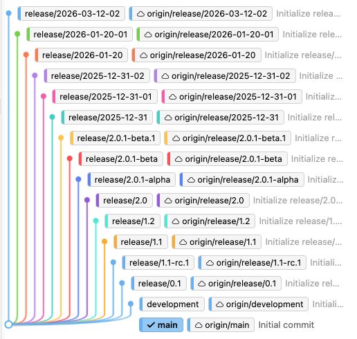

# cascading-auto-merge-test

Repository to test GitHub cascading auto-merge functionality across multiple branches.

- Initial Setup (starting position)


## 📋 Overview

This repository contains multiple release branches with automated workflows for testing cascading merge scenarios. The included scripts help maintain and reset the repository structure for testing purposes.

## 🔧 Setup Scripts

### 1. `reset-repository.sh` - Master Reset Script

**Purpose**: Resets the entire repository to a clean, pristine state for testing.

**What it does**:
- Deletes all unwanted branches (local and remote)
- Squashes main branch to a single commit
- Resets all other branches to clean state (2 commits each)
- Ensures each branch has a unique file to prevent merge conflicts

**End State**:
- **Main branch**: 1 commit with ALL files (README, LICENSE, .gitignore, workflows, branches.png, etc.)
- **Each other branch**: 2 commits
  - Commit 1: Initial commit (inherited from main, includes ALL files)
  - Commit 2: Branch-specific commit with ONE additional unique file

**Branch Structure**:
```
main
├── development
├── release/0.1
├── release/1.1-rc.1
├── release/1.1
├── release/1.2
├── release/2.0
├── release/2.0.1-alpha
├── release/2.0.1-beta
├── release/2.0.1-beta.1
├── release/2025-12-31
├── release/2025-12-31-01
├── release/2025-12-31-02
├── release/2026-01-20
├── release/2026-01-20-01
└── release/2026-03-12-02
```

**Usage**:
```bash
./reset-repository.sh
```

⚠️ **WARNING**: This rewrites Git history and requires force push! Temporarily disable branch protection on main before running.

---

### 2. `squash-main.sh` - Squash Main Branch

**Purpose**: Collapses all commits on the main branch into a single "Initial commit" while preserving all current files and their content (including branches.png).

**What it does**:
1. Creates a new branch with no history (orphan branch)
2. Commits all current files as a single "Initial commit"
3. Replaces the old main branch with the new one
4. Force pushes to remote

**Use Case**: Clean up commit history on main branch for testing purposes.

**Usage**:
```bash
./squash-main.sh
```

**Result**:
- **Before**: Multiple commits with full history
- **After**: 1 commit - "Initial commit"

⚠️ **WARNING**: This rewrites Git history and requires force push! Make sure branch protection is temporarily disabled before running.

---

### 3. `squash-all-branches.sh` - Squash All Branches

**Purpose**: Squashes EVERY branch in the repository to a single commit, preserving all current files on each branch (including branches.png).

**What it does**:
- Collapses all commits on each branch into ONE commit per branch
- Preserves all current files exactly as they are (including branches.png)
- Creates commit message: "Initial commit for [branch-name]"
- Force pushes all branches to remote

**Difference from `reset-repository.sh`**:
- `reset-repository.sh`: Creates specific structure with unique files per branch
- `squash-all-branches.sh`: Just squashes whatever exists on each branch now

**Usage**:
```bash
./squash-all-branches.sh
```

**Result**:
- **Before**: Multiple commits per branch
- **After**: 1 commit per branch (files unchanged)

⚠️ **WARNING**: This rewrites Git history on ALL branches! Requires force push for every branch.

---

### 4. `push-workflows.sh` - Push Workflows to All Branches

**Purpose**: Distributes GitHub workflow files from the main branch to all other branches.

**What it does**:
1. Checks out the main branch
2. For each branch in the list:
   - Resets to remote state
   - Checks out `.github/workflows/` directory from main
   - Commits and pushes if there are changes
3. Returns to main branch

**Use Case**: When you update workflows on main and need to propagate them to all release branches for consistent CI/CD behavior.

**Usage**:
```bash
./push-workflows.sh
```

**Output**:
- ✅ Workflows added/updated on each branch
- ℹ️  Skips branches where workflows are already up-to-date

**No History Rewrite**: This script does NOT rewrite history - it creates new commits on each branch.

---

## 🚀 Quick Start

1. **Fresh Testing Start**:
   ```bash
   ./reset-repository.sh    # Creates clean branch structure
   ./push-workflows.sh      # Distributes workflows to all branches
   ```

2. **Clean Up Commit History**:
   ```bash
   ./squash-main.sh         # Squash main only
   # OR
   ./squash-all-branches.sh # Squash all branches
   ```

3. **Update Workflows Across Branches**:
   ```bash
   ./push-workflows.sh      # After modifying workflows on main
   ```

## ⚠️ Important Notes

- **File Preservation**: All scripts preserve existing files including `branches.png`, documentation, and configuration files
- **Branch Protection**: Temporarily disable branch protection rules on main before running any script that rewrites history (`reset-repository.sh`, `squash-main.sh`, `squash-all-branches.sh`)
- **Force Push**: All history-rewriting scripts use `git push -f`, which overwrites remote history
- **Backup**: Consider creating a backup before running these scripts if you need to preserve any commit history
- **Testing Only**: These scripts are designed for test repositories with cascading merge scenarios

## 📚 Branch Naming Convention

Release branches follow semantic versioning and date-based patterns:
- **Version-based**: `release/X.Y`, `release/X.Y.Z-alpha`, `release/X.Y.Z-beta`
- **Date-based**: `release/YYYY-MM-DD`, `release/YYYY-MM-DD-NN`

## 🤝 Contributing

This is a test repository for GitHub Actions. Modify the branch lists in the scripts to match your testing needs.
